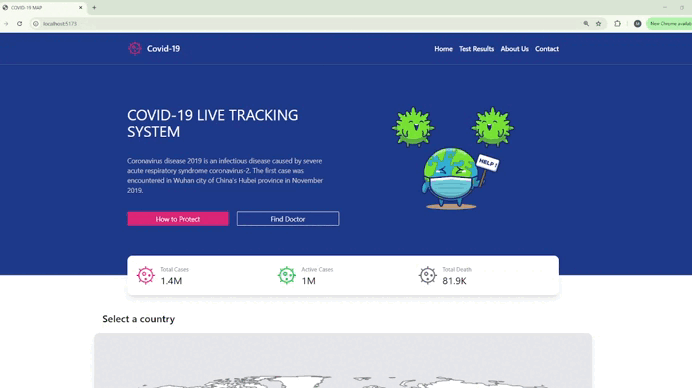

# 🚀 COVID-19 map application
This project was created to practice unit testing, integrating Redux-Thunk for API data fetching. I also used React Testing Library and Jest to test components, functions, and the Redux store.
# 🛠 Project Features
✅ Live COVID-19 data is fetched from an API and displayed on the homepage.

✅ React Simple Maps integration for an interactive world map.

✅ Clicking on a country redirects to its detail page, showing real-time COVID-19 statistics.

✅ Redux Toolkit + Thunk for global state management.

✅ Unit Tests:

How to test simple components ?

How to test functions ?

How to verify Redux store updates correctly?

How to test components using Providers and props?

📍This project provided me with a great opportunity to gradually integrate unit testing step by step.
# Preview of the project

